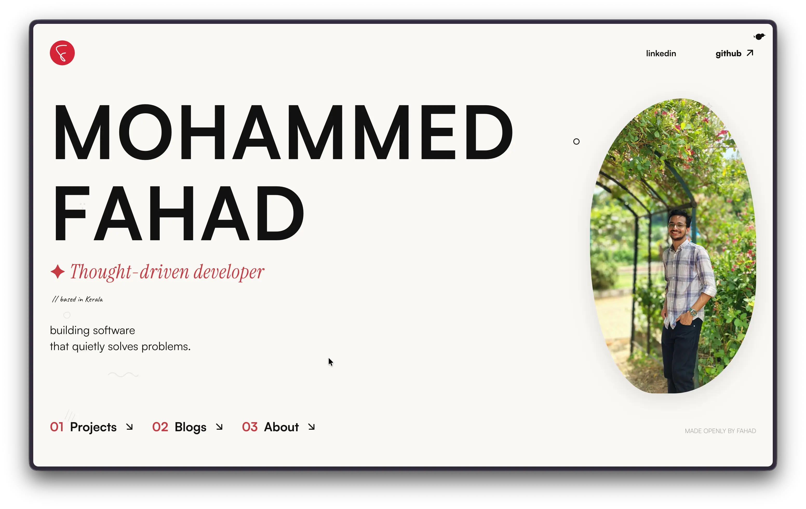

# justfahad.me

<p align="center">
  
</p>

<p align="center">
  
  
  
  
  
</p>

My little corner of the internet — a personal site for projects, writing, and the cool things I stumble upon. Built to be fast, minimal, and personal.

🚀 [justfahad.me](https://justfahad.me)

---

## Features

- **Projects** — detailed write-ups with image galleries, source & demo links
- **Blog** — long-form posts with Giscus-powered comments
- **Scratchpad** — lightweight, high-frequency link & thought logging. Entries are YAML files committed via a Telegram bot — no CMS, no database
- **Custom cursor** — 60fps cursor with hover-aware states
- **Interactive creatures** — tiny SVG doodles (cat, bird, ghost, snail, chaya cup) that react to tap/hover
- **Confetti** — hidden easter egg on triple-logo tap
- **Selection sharing** — highlight text to copy/share
- **OG prerendering** — post-build script injects Open Graph tags for social previews

## Stack

| Layer                    | Technology                   |
| ------------------------ | ---------------------------- |
| Framework                | React 19 + TypeScript        |
| Bundler                  | Vite 6                       |
| Routing                  | React Router v7              |
| Styling                  | Tailwind CSS v4 + custom CSS |
| Animations               | motion/react 12              |
| Content (blogs/projects) | Markdown + gray-matter       |
| Content (scratchpad)     | YAML + js-yaml               |
| Comments                 | Giscus (GitHub Discussions)  |
| Images                   | Swiper carousel              |
| Icons                    | Tabler Icons                 |

## Getting started

```bash
git clone https://github.com/FahadLive/Personal-Website
cd Personal-Website
pnpm install
pnpm run dev
```

### Commands

| Command          | Description                               |
| ---------------- | ----------------------------------------- |
| `pnpm run dev`   | Start dev server                          |
| `pnpm run build` | Build for production + prerender OG pages |
| `pnpm run start` | Preview production build                  |
| `pnpm run lint`  | Run ESLint                                |

## Content

| Section    | Source                            | Format                 |
| ---------- | --------------------------------- | ---------------------- |
| Projects   | `content/projects/*.md`           | Markdown + frontmatter |
| Blogs      | `content/blogs/**/*.md`           | Markdown + frontmatter |
| Scratchpad | `content/scratchpad/YYYY-MM.yaml` | YAML list              |

Scratchpad entries are added via **Charlie** — a Telegram bot (Cloudflare Worker) that commits YAML directly to this repo.

## Design

Warm, handmade aesthetic inspired by [wandixu.com](https://wandixu.com) and [scalzodesign.be](https://scalzodesign.be). Custom design tokens defined in `src/index.css`:

| Token             | Value     |
| ----------------- | --------- |
| `--color-surface` | `#FAF8F3` |
| `--color-ink`     | `#111111` |
| `--color-accent`  | `#C53B42` |
| `--color-mustard` | `#D9A441` |

Three typefaces: **Satoshi** (sans), **Instrument Serif** (serif), **Caveat** (hand).

## Project structure

```
src/
├── pages/            # Route-level components
├── components/       # Shared UI + interactive creature SVGs
├── utils/            # Markdown & YAML data loaders
├── lib/              # Confetti, utilities
├── index.css         # Tailwind v4 theme tokens + global styles
└── app.tsx           # Router & Suspense wrapper

content/              # All written content (source of truth)
├── blogs/
├── projects/
└── scratchpad/

scripts/
└── prerender.mjs     # Post-build OG tag injection

docs/                 # Screenshots
```
